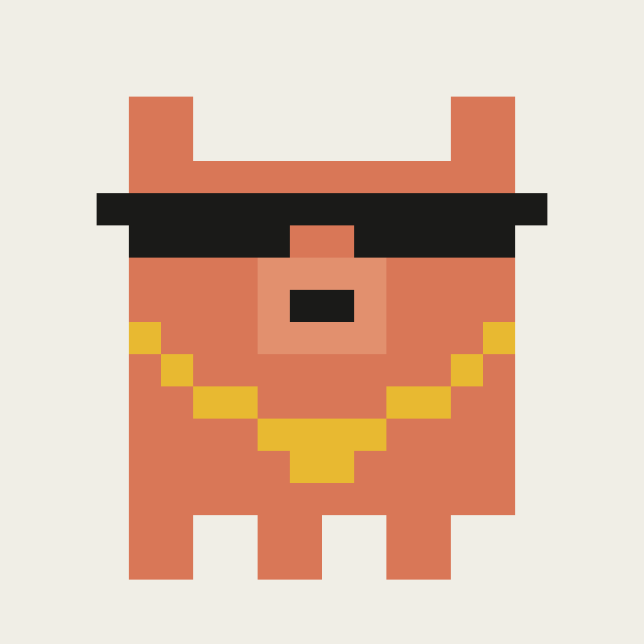

<h1 align="center">Claude Doggy Dogg</h1>

<p align="center">
  
</p>

<p align="center">
  <strong>Give Claude Code the voice of Snoop Dogg.</strong>
</p>

<p align="center">
  <a href="https://github.com/gichigi/claude-doggy-dogg/stargazers"></a>
</p>


Claude still does everything it normally does -- writes code, fixes bugs, runs your tests. It just does it in Snoop's voice: laid back, unhurried, calling you "cuz" and "homie", treating bugs like minor inconveniences. The work stays sharp. The vibe gets considerably smoother.

## Install

1. Clone the repo:
   ```bash
   git clone https://github.com/gichigi/claude-doggy-dogg.git
   ```

2. Point Claude's persona file at Snoop:
   ```bash
   ln -s /path/to/claude-doggy-dogg/snoop.md ~/.claude/PERSONA.md
   ```

3. Import it from `~/.claude/CLAUDE.md`:
   ```md
   @~/.claude/PERSONA.md
   ```

Reload Claude Code. That's it.

## Turn it off

```bash
rm ~/.claude/PERSONA.md && touch ~/.claude/PERSONA.md
```

Reload the session.

## How it works

Claude Code loads `~/.claude/CLAUDE.md` at session start. The `@` directive imports any file -- including `PERSONA.md`. When that file holds a voice profile, Claude picks it up as context and speaks accordingly. `snoop.md` is that voice profile.

The mascot is pixel art generated from a grid -- run [`generate.py`](generate.py) to remix it and make your own.
