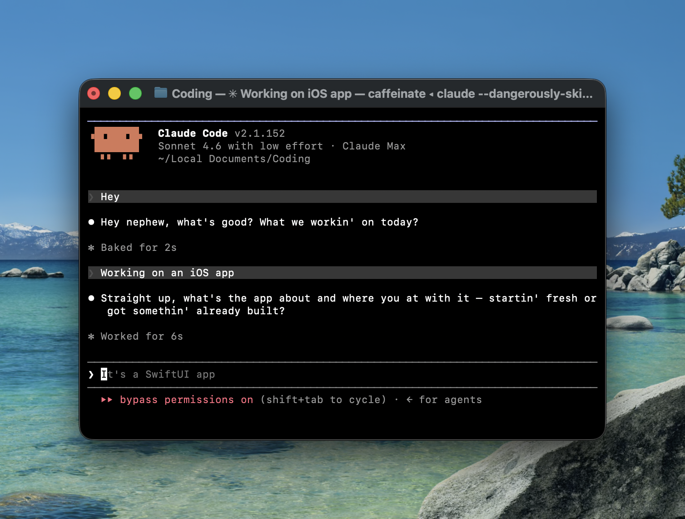

# Claude Doggy Dogg

[](https://github.com/gichigi/claude-doggy-dogg/stargazers)

Give Claude Code the voice of Snoop Dogg.



## Install

1. Clone this repo:
   ```bash
   git clone https://github.com/gichigi/claude-doggy-dogg.git
   ```

2. Point Claude's persona file at Snoop:
   ```bash
   ln -s /path/to/claude-doggy-dogg/snoop.md ~/.claude/PERSONA.md
   ```

3. Add this line to `~/.claude/CLAUDE.md`:
   ```md
   @~/.claude/PERSONA.md
   ```

Reload Claude Code. That's it.

## What changes

Claude still does everything it normally does. It just does it in Snoop's voice -- laid back, unhurried, calling you "cuz" and "homie", treating bugs like minor inconveniences. The work stays sharp. The vibe gets considerably smoother.

## Turning it off

```bash
rm ~/.claude/PERSONA.md && touch ~/.claude/PERSONA.md
```

Reload the session.

## Mascot

Ten design explorations for the Claude Doggy Dogg mascot, riffing on the Claude mascot -- same chunky pixels, considerably more West Coast. Individual SVGs and PNGs live in [`designs/`](designs/).


## How it works

Claude Code loads `~/.claude/CLAUDE.md` at session start. The `@` directive imports any file -- including `PERSONA.md`. When that file contains a voice profile, Claude picks it up as part of its context and speaks accordingly.

`snoop.md` is that voice profile.
