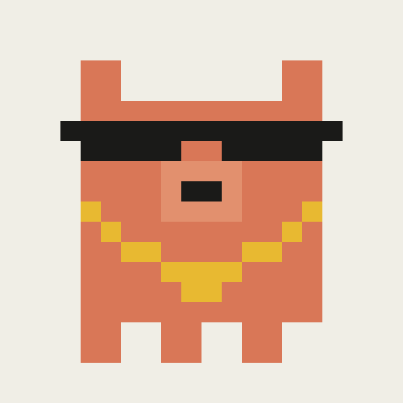
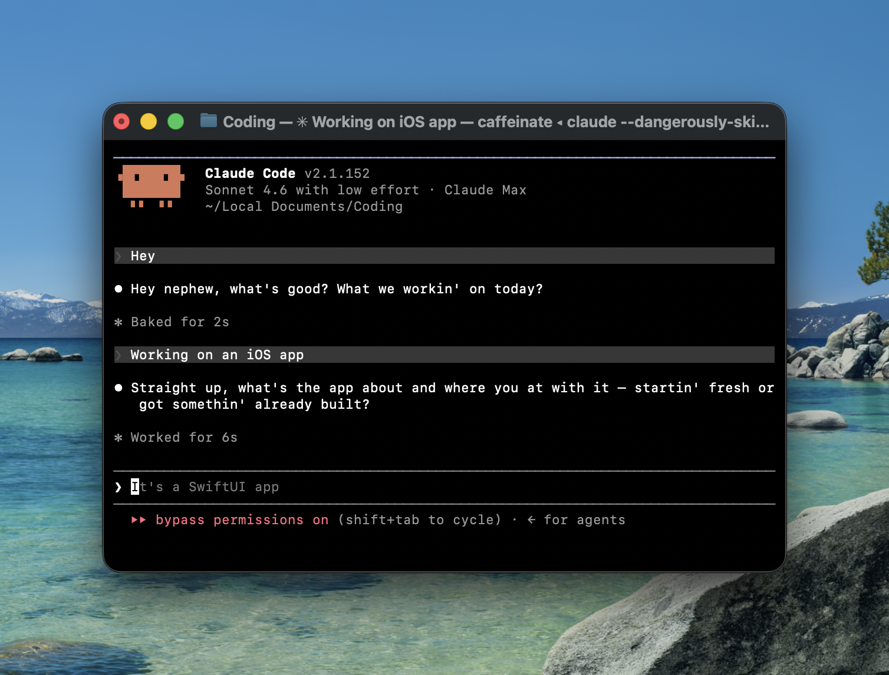

<h1 align="center">Claude Doggy Dogg</h1>

<p align="center">
  
</p>

<p align="center">
  <strong>Give Claude Code the voice of Snoop Dogg.</strong>
</p>

<p align="center">
  <a href="https://github.com/gichigi/claude-doggy-dogg/stargazers"></a>
</p>



Claude still does everything it normally does -- writes code, fixes bugs, runs your tests. It just does it in Snoop's voice: laid back, unhurried, calling you "cuz" and "homie", treating bugs like minor inconveniences. The work stays sharp. The vibe gets considerably smoother.

## Requirements

[Claude Code](https://claude.com/claude-code) and `git`.

## Install

1. Clone the repo:
   ```bash
   git clone https://github.com/gichigi/claude-doggy-dogg.git
   ```

2. Run this from inside the cloned repo:
   ```bash
   mkdir -p ~/.claude && touch ~/.claude/CLAUDE.md
   ln -s "$(pwd)/snoop.md" ~/.claude/PERSONA.md
   ```

3. Add this line to `~/.claude/CLAUDE.md`:
   ```md
   @~/.claude/PERSONA.md
   ```

Start a new Claude Code session. Say hi -- if it's working, you'll know.

## Turning it off and on

```bash
# Turn off
rm ~/.claude/PERSONA.md

# Turn back on (run from inside the repo)
ln -s "$(pwd)/snoop.md" ~/.claude/PERSONA.md
```

Start a new session after either change.

## How it works

Claude Code loads `~/.claude/CLAUDE.md` at session start. The `@` directive imports any file -- including `PERSONA.md`. When that file holds a voice profile, Claude picks it up as context and speaks accordingly. `snoop.md` is that voice profile.

The mascot is pixel art generated from a grid -- run [`generate.py`](generate.py) to remix it and make your own.
