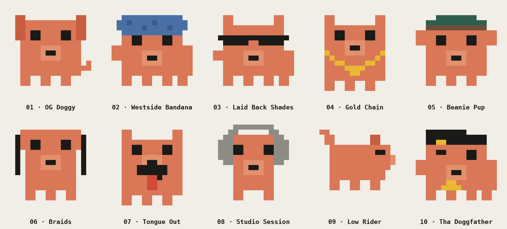

# Mascot design explorations

Ten takes on a Claude Doggy Dogg mascot, based on the Claude mascot's pixel style: coral `#D97757` on cream `#F0EEE6`, chunky square pixels, black square eyes.

**The chosen mascot** ([`mascot.png`](mascot.png) / [`mascot.svg`](mascot.svg)) combines explorations 03 and 04 — wraparound shades plus the gold chain. It's the hero image at the top of the main README.

| # | Design | Idea |
|---|--------|------|
| 01 | OG Doggy | The baseline dog-ification: floppy ears, snout, tail |
| 02 | Westside Bandana | Blue paisley bandana tied over the head |
| 03 | Laid Back Shades | Wraparound shades, unbothered |
| 04 | Gold Chain | Pointy ears and a heavy gold chain |
| 05 | Beanie Pup | Beanie pulled low, ears poking out |
| 06 | Braids | Braids hanging down both sides |
| 07 | Tongue Out | Happy dog energy |
| 08 | Studio Session | Big studio headphones |
| 09 | Low Rider | Full pup in profile, tail up, rollin' |
| 10 | Tha Doggfather | Tilted cap, wink, gold chain |

Each design ships as an SVG (crisp at any size, renders in GitHub READMEs) and a PNG (for social). Everything is generated from pixel grids in [`generate.py`](generate.py) -- edit a grid, run `python3 generate.py`, and the SVGs, PNGs, and contact sheet regenerate.
